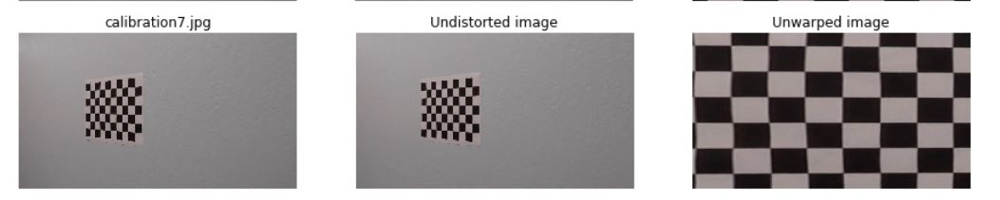
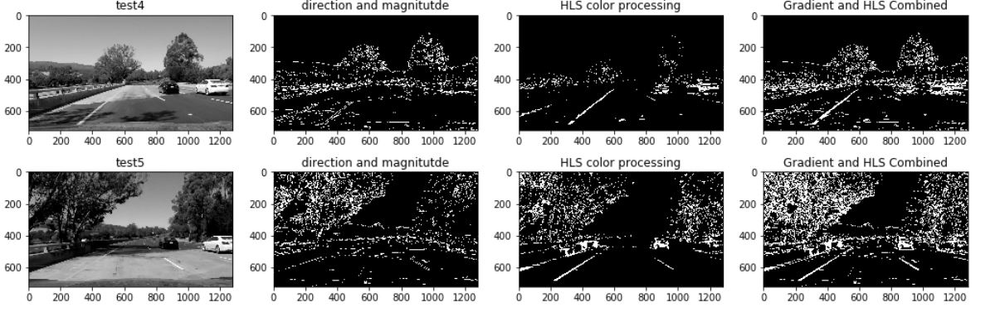
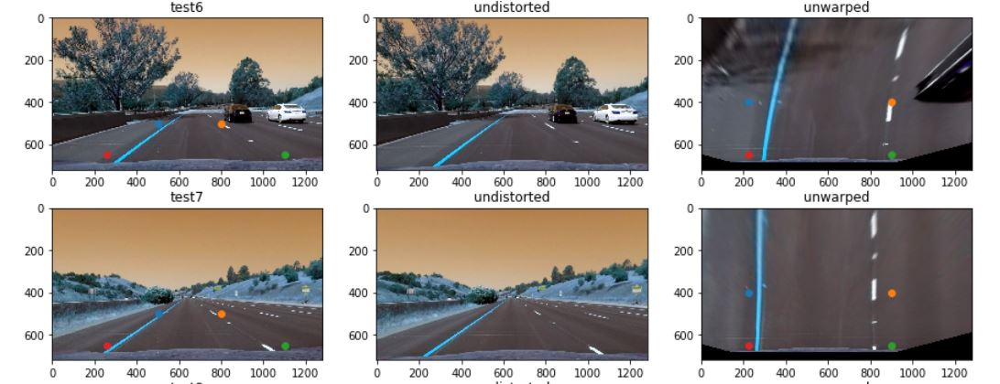
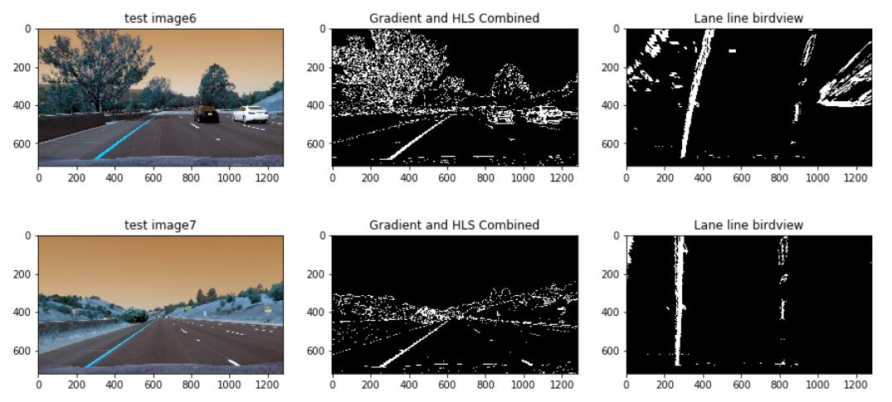
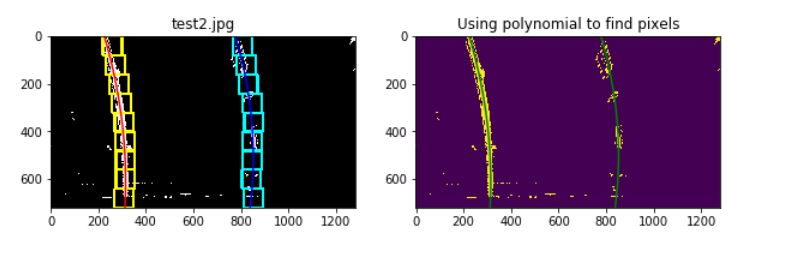
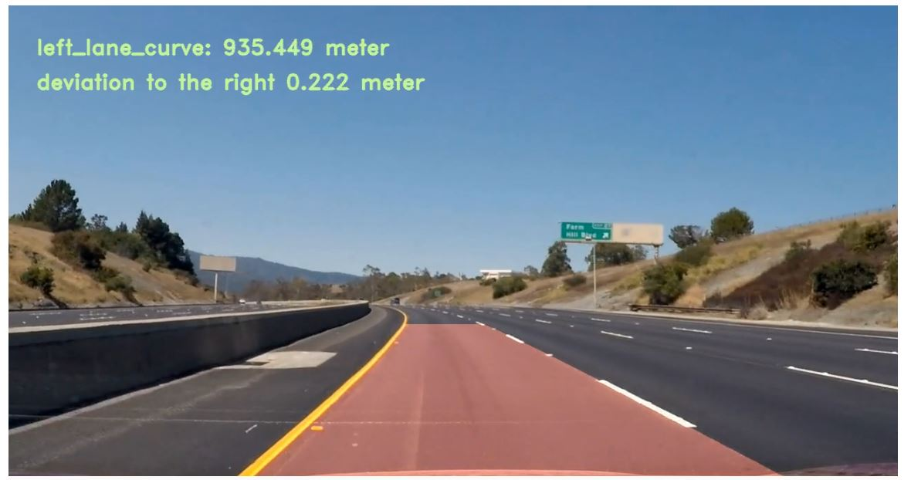

### Writeup / README

**Advanced Lane Finding Project**

The goals / steps of this project are the following:

* Compute the camera calibration matrix and distortion coefficients given a set of chessboard images.
* Apply a distortion correction to raw images.
Function used: 
cv2.findChessboardCorners

cv2.drawChessboardCorners

cv2.calibrateCamera

cv2.getPerspectiveTransform(src, dst)

cv2.warpPerspective(image, M, img_size)



* Use color transforms, gradients, etc., to create a thresholded binary image.

Critical functions: 
cv2.cvtColor(img, cv2.COLOR_BGR2HLS)
cv2.Sobel(gray, cv2.CV_64F,1,0,ksize=3)
* Apply a perspective transform to rectify binary image ("birds-eye view").


* Detect lane pixels and fit to find the lane boundary.
* Determine the curvature of the lane and vehicle position with respect to center.

* Determine the curvature of the lane and vehicle position with respect to center.

* Warp the detected lane boundaries back onto the original image.
* Output visual display of the lane boundaries and numerical estimation of lane curvature and vehicle position.
 


### Camera Calibration

#### 1. Briefly state how you computed the camera matrix and distortion coefficients. Provide an example of a distortion corrected calibration image.

The code for this step is contained in the first code cell of the IPython notebook located in ** Camera Calibration**. 

I start by preparing "object points", which will be the (x, y, z) coordinates of the chessboard corners in the world. Here I am assuming the chessboard is fixed on the (x, y) plane at z=0, such that the object points are the same for each calibration image.  Thus, `objp` is just a replicated array of coordinates, and `objpoints` will be appended with a copy of it every time I successfully detect all chessboard corners in a test image.  `imgpoints` will be appended with the (x, y) pixel position of each of the corners in the image plane with each successful chessboard detection.  

I then used the output `objpoints` and `imgpoints` to compute the camera calibration and distortion coefficients using the `cv2.calibrateCamera()` function.  I applied this distortion correction to the test image using the `cv2.undistort()` function and obtained this result: 

* Compute the camera calibration matrix and distortion coefficients given a set of chessboard images.
* Apply a distortion correction to raw images.
Function used: 
cv2.findChessboardCorners

cv2.drawChessboardCorners

cv2.calibrateCamera

cv2.getPerspectiveTransform(src, dst)

cv2.warpPerspective(image, M, img_size)


#### Apply Sobel Operators to the images

##### The process is described briefly below:

1. Convert a colored image to gray
2. Apply Sobel operator to the gray image
3. Because Sobel operators applied, values of some pixels in the image were negative, which did not have much meanings in the context of a gray image. Therefore they were converted to positive values by apply abs function. 
4. In order to make the gradient image more clearly, use 1 to the pixel that are likely to be edges, and use 0 for the rest. 
5. Apply direction of the gradient to the image. 

Conclusion: even applied these processings, the lane lines of test1, test4, and test5 images were not well detected. By observing those images, we found they shared similiaries: shadows, strong sunlight, and color of the road surface. Therefore, other more processings, probably color processing, are needed for those images. 

##### HLS color processing:
After applying HLS color space, the lane lines were clearly detected regardless of shadow or sun light. 


#### 3. Describe how (and identify where in your code) you performed a perspective transform and provide an example of a transformed image.

def unwarp_image(image, src, dst):
    M = cv2.getPerspectiveTransform(src, dst)
    ###### Warp the image using OpenCV warpPerspective()
    img_size = (image.shape[1],image.shape[0])
    warped = cv2.warpPerspective(image, M, img_size)
    return warped
    
``` 
src = np.float32([(505,500), (800,500), (1100,650), (260,650)])
dst = np.float32([(225,400), (900,400), (900,650), (225,650)])
```

This resulted in the following source and destination points:

| Source        | Destination   | 
|:-------------:|:-------------:| 
| 505,500      | 225,400        | 
| 800,500      | 900,400       |
| 1100,650     | 900,650      |
| 260,650      | 225,650       |

The coordinates of source and destination were tried several times before finalzied. 

For different images, src and dst may change to better screen out the lane lines, therefore, an automatical method is preferred. 

I verified that my perspective transform was working as expected by drawing the `src` and `dst` points onto a test image and its warped counterpart to verify that the lines appear parallel in the warped image.


#### 4. Describe how (and identify where in your code) you identified lane-line pixels and fit their positions with a polynomial?

### Finding the lines using histogram

### Now the image's binary output was obtained. Now it is time to detect lane lines. 

##### The basic idea is to divide the image to several small windows. Generally, the smaller, the better, because when the window is large, several peaks may occur, and if the largest peak happens close the midpoint, the pixels with smaller x coordinates may be located outside of the window, resulting in less robustness. In addition, with more small windows, the size of block can be reduced too, which is helpful to isolate noises. On the other side, if the window is too small, it becomes costly to calculate. I think divide the images into 4, instead of 2, is a more reasonable choice.  
### Keep searching the next frame image after the lines are identified

#### Let's assume the test image is just the next frame image respectively


#### 5. Describe how (and identify where in your code) you calculated the radius of curvature of the lane and the position of the vehicle with respect to center.

sample code here: 

    left_fit = pixel2meter(left_fit) ## convert coefficients in pixel to coefficients in meter
    right_fit = pixel2meter(right_fit)
    
    y_eval = 30 #check the curvature at the bottom of the image
    
    left_curverad = round(((1 + (2*left_fit[0]*y_eval + left_fit[1])**2)**1.5) / np.absolute(2*left_fit[0]),3)
    right_curverad = round(((1 + (2*right_fit[0]*y_eval + right_fit[1])**2)**1.5) / np.absolute(2*right_fit[0]),3)
    
    devia = round(deviation(binary,left_fit, right_fit),3)
    
    if devia >=0:
        print('Left lane curve:',left_curverad, 'm', 'Right lane curve:',right_curverad,'m', 'deviation to the left:',devia,'m')
    if devia <0:
        print('Left lane curve:',left_curverad, 'm', 'Right lane curve:',right_curverad,'m', 'deviation to the right:',-devia,'m')

#### 6. Provide an example image of your result plotted back down onto the road such that the lane area is identified clearly.

The key point here is to use warpPersepctive to find the Minv matrix

* Warp the detected lane boundaries back onto the original image.
* Output visual display of the lane boundaries and numerical estimation of lane curvature and vehicle position.
 

---

### Pipeline (video)

#### 1. Provide a link to your final video output.  Your pipeline should perform reasonably well on the entire project video (wobbly lines are ok but no catastrophic failures that would cause the car to drive off the road!).

Here's a [link to my video result](./project_video_output1.mp4)

---

### Discussion

####  Briefly discuss any problems / issues you faced in your implementation of this project.  Where will your pipeline likely fail?  What could you do to make it more robust?

1. Carefully select the area that just includes the lane line area to reduce noise from other unrelated area. However, this one is difficult since the area is changing, and sometimes change a lot. 

2. There are conditions that it was so dark that lane lines were almost undetected using gradient or hls. In this case, probably we'd better to guess the lane line by referring to previous polynomial curves.


